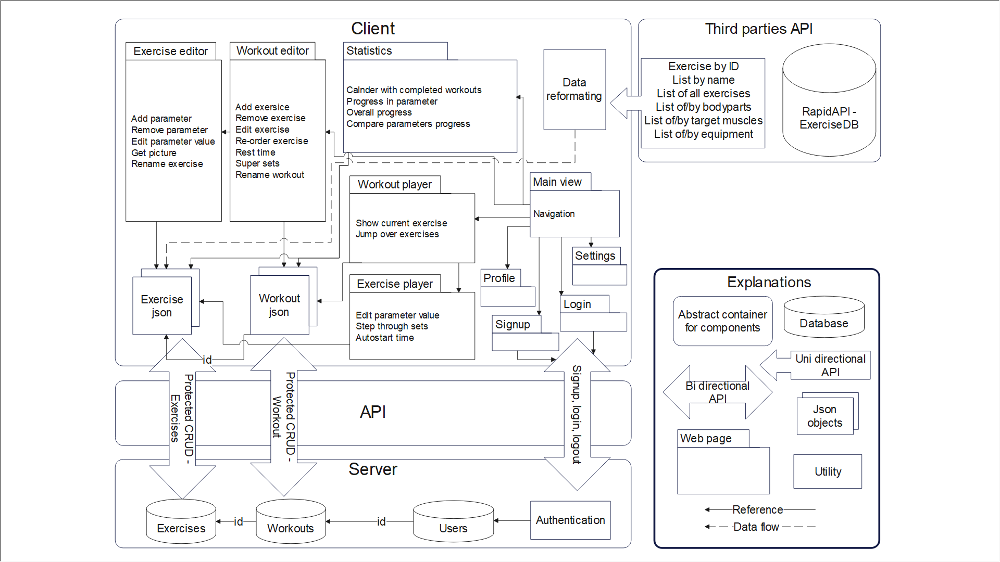

# Log1 - Minimum viable product

## Feature description

### What is minimum viable product?

When I code larger projects, I satrt by making a minimum viable produc (MVP). A minimum viable product is like a prototype, but you strip away all the features that are not at the absolut core of the project. You know that you have the core of the project, when if you remove more features, testing the product doesn't make sense any more. And you have to be harsh when you are stripping the project down to its core. I like to ask myself the question, what are the core, most difficult parts of the project, that if I don't add, no other part wil work. And if I try to add them later in the prosess, it might be difficult to add. For example, I should add one API endpoint in the backend, and one API-requester in the frontend to test that i can get the API to work. But when I have added and tested that, I dont need to add more API enpoint, because they will likely be no more difficult to add. I will also try to launch the backent and frontend to the web as fast as posible, just so that I know it works from the start. This is also usefull, because if I add a feaature, and the website crashes, I know the problem is in that feature.

### Software architecture.

To make the MVP, I first have to know what the core features of the project is. And to know that, I have to know what the main overarching features are. That is why I start by making a software architecture design. The design looks loke this:


Looking at the design, we can se that the client will have manny different webpage views with many features, such as editing and playing, workouts with exercises. The Server will be mainly for storing data and authenticating users. And a thirdparty API with premade exercises will be used.


### Figuring out the minimum viable product

My MVP will consist of:
1. A secure signup, login and logout system with minimal UI on client and secure password-manager user database on backend.
2. Protected CRUD API, but for a single string transfer, with a database on backend.
3. Simple ui for accesing and using CRUD API. 
4. Third party API data fetcher.
5. Launching the backend and the frontend to the web successfully.

Once these 5 point are finished, the MVP is finished.

Other features, like statistics view, the player, and data reformater; though difficult and necessary, I assume I will be able to cross that bridge when I get there. Also, the reason why I included the connection the the third party - even thoug it is not core to the project - is that it might introduce unexpected problems, connecting to a third party. So I want so know from the start that it works.

## Coding the feature

### Server initialisation

To manage this project, I use npm and npx, because they are quite minimal, and I avoid a lot of boilerplate code.

Since commands in the commandline are not tracable in the repository, I will specify them bellow, so that the process can still be traced.

```bash
/code/server $ npm init          # Then i filled in the options I wanted, the result can be viewed in code/server/package.json
/code/server $ npm install --save-dev typescript 
/code/server $ npx tsc --init
/code/server $ npm install --save express
/code/server $ npm install --save-dev @types/express
/code/server $ npm install concurrently nodemon --save-dev
```

Then I made a simple hello world script in index.ts